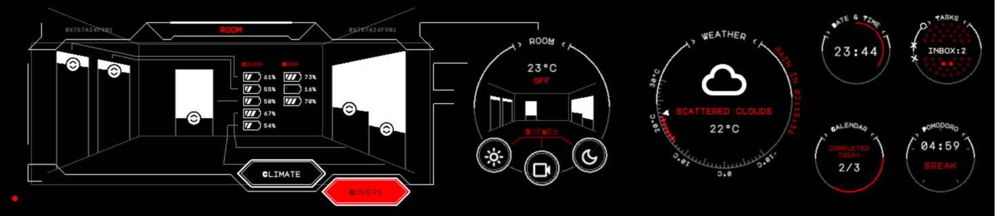
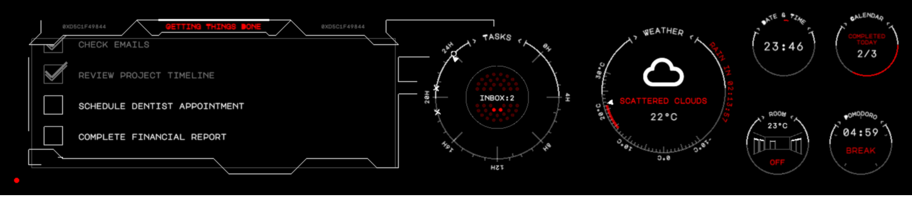
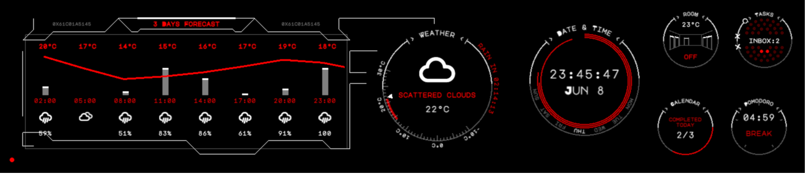

# Desk-HUD

Desk-HUD is a compact side monitor designed to enhance productivity and convenience in your workspace. It features an 11.9-inch touch screen connected to a Raspberry Pi hardware platform, providing quick access to essential features like a todo list, calendar, weather updates, clock, and smart device control for items such as window covers and air conditioning. With Desk-HUD, managing tasks, staying organized, and controlling your environment becomes effortless, all while keeping everything you need within reach on your desk.

Desk-HUD is specifically tailored to meet my unique requirements and is not intended as a one-size-fits-all solution. However, the project's source code is open for anyone to fork and customize according to their individual needs and preferences.

# Demo

You can experience a demo of Desk-HUD by visiting the following URL: [https://desk-hud.jmrlab.com](https://desk-hud.jmrlab.com). Please note that the demo uses simulated data to showcase the features, giving you a feel for Desk-HUD's functionality and is not connected to real systems.

# Installation Guide

- [Hardware setup](doc/install_hardware.md)
- [Software installation](doc/install_software.md)