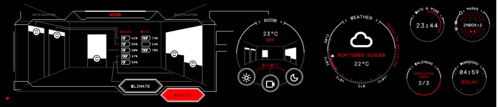
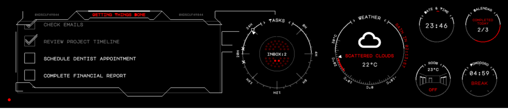
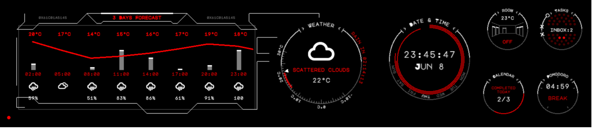

# Desk-HUD

Desk-HUD is a compact side monitor designed to enhance productivity and convenience in your workspace. It features an 11.9-inch touch screen connected to a Raspberry Pi hardware platform, providing quick access to essential features like a todo list, calendar, weather updates, clock, and smart device control for items such as window covers and air conditioning. With Desk-HUD, managing tasks, staying organized, and controlling your environment becomes effortless, all while keeping everything you need within reach on your desk.







# Installation

## Configuration of Google API

- In the Google Cloud console, go to Menu `APIs & Services` > `Credentials`.
- Click `Create Credentials` > `OAuth client ID`.
- Click `Application type` > `Desktop app`.
- In the `Name` field, type a name for the credential. This name is only shown in the Google Cloud console.
- Click `Create`. The OAuth client created screen appears, showing your new Client ID and Client secret.
- Click `OK`. The newly created credential appears under OAuth 2.0 Client IDs.
- Save the downloaded JSON file as `credentials.json`
- Open `OAuth consent screen` and yourself to `Test users`

## Setup project on local machine

- Clone reporistory `git clone https://github.com/jamro/desk-hud.git`
- Enter project folter `cd desk-hud`
- Install dependencies `init i`
- Rename `desk-hud-config.default.json` to `desk-hud-config.json` and fill missing data. You can leave google auth info empty for now. It will be filled by auth sript in next steps
- Move `credentials.json` file downloaded in previous steps to `./desk-hud` folder
- Authorize in Google `node google_auth.js`. The script will create/populate `./.env` file

## Configuration of Raspberry PI

- [RPI] Expand filesystem `sudo raspi-config` > `Advanced Options` > `Expand Filesystem`
- [RPI] Enable ssh `sudo raspi-config`
- [RPI] Disable screen saver ` xset s off`
- [RPI] Edit `/boot/config.txt` and replace `dtoverlay=vc4-kms-v3d` by `dtoverlay=vc4-fkms-v3d` to enable hdmi monitor control
- [local] generate public and private keys `ssh-keygen`
- [local] copy public key to remote host `ssh-copy-id -i ~/.ssh/id_rsa.pub pi@raspberrypi.local`
- [local] add key to ssh: `ssh-add`
- [local] connect to Raspberry PI: `ssh [username]@[hostname].local`
- [RPI] Install Node.js 
```bash
sudo su
curl -fsSL https://deb.nodesource.com/setup_18.x | bash -
sudo apt-get install -y nodejs
```
- [RPI] Install PM2 `sudo npm install pm2@latest -g`
- [RPI] make sure PM2 starts automatically after boot `pm2 startup`
- [RPI] Create app folder
```bash
sudo mkdir /var/www
sudo chown pi /var/www
```
- [RPI] setup env vars and copy them from your local `./.env` file: `sudo nano /etc/environment`
```
DHUD_CONFIG=/home/pi/desk-hud-config.json 
```
- [local] copy config to Raspberry PI: `scp desk-hud-config.json pi@raspberrypi.local:/home/pi/desk-hud-config.json `
- [local] provision remote host `npm run provision-remote`
- [local] deploy `npm run deploy`
- [RPI] provision remote host `npm run provision-remote`
