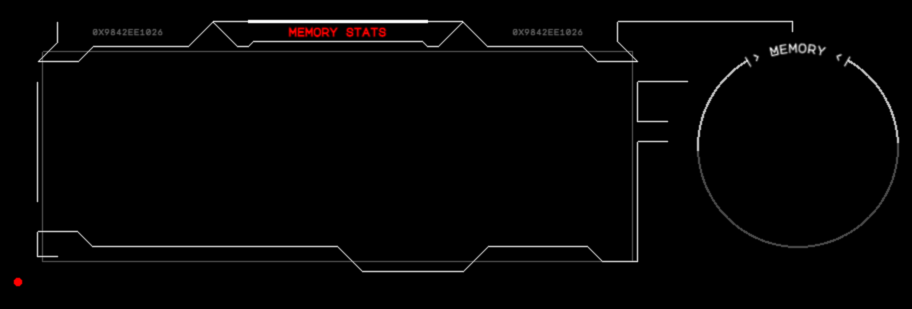
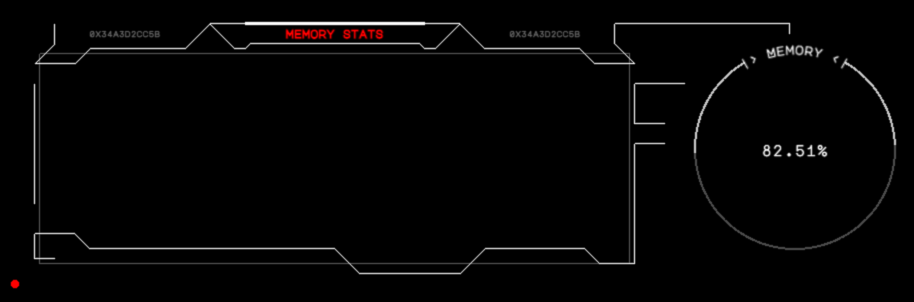
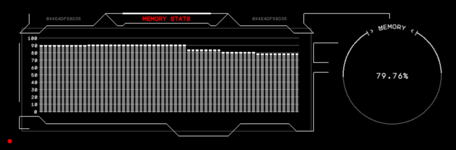

# Development Guide - Create a widget

This tutorial shows how to create and add a new widget to Desk HUD. During this walkthrough, 
we are going to create "Memory" widget which monitors memory usage on Raspberry PI device

## Initialize an empty widget

- Create new folder for the widget at `src/widgets/memory`
- Create widget class `src/widgets/memory/MemoryWidget.js`:
```js
import Widget from '../../frontend/Widget.js'

export default class MemoryWidget extends Widget {
  constructor() {
    super('memory', "Memory")

    // set header of main widget window
    this.main.title = "memory stats"
  }
}
```
- Add new widget to `src/widgets/widgets.js`:
```js
import MemoryWidget from './memory/MemoryWidget'
...
const widgets = [
  ...,
  MemoryWidget
]
```



## Integrate backend service

- Create widget class `src/widgets/memory/MemoryService.js`:
```js
const Service = require("../../backend/services/Service");
const os = require('os');

class MemoryService extends Service {

  constructor(config, io) {
    super(config, io, 'memory')
    this._loop = null
  }

  async start() {
    if(this._loop) {
      clearInterval(this._loop)
    }
    // send update over web socket to the client every 1000ms
    this._loop = setInterval(() => this.update(), 1000)
    this.update()
  }

  async welcomeClient(socket) {
    // send memory usage to the client once it is connected
    this.emit(this.getMemoryUsage(), socket)
  }

  update() {
    // send memory usage updates regularly 
    this.emit(this.getMemoryUsage())
  }

  getMemoryUsage() {
    return {free: os.freemem(), total: os.totalmem()}
  }
}

module.exports = MemoryService
```

- Add new service to `src/widgets/services.js`: 
```js
const MemoryService = require("./memory/MemoryService")
...

const services = [
  ...,
  MemoryService
]
module.exports = services
```

- Extend `MemoryWidget` to display data sent by the service:
```js
import Widget from '../../frontend/Widget.js'
import TextField from '../../frontend/components/TextField.js'

export default class MemoryWidget extends Widget {
  constructor() {
    super('memory', "Memory")

    // set header of main widget window
    this.main.title = "memory stats"

    // store memory usage sent from MemoryService
    this.initState({ usage: 0 })

    // text field to shot memory usage
    this._usageLabel = new TextField('', {
      fontFamily: 'MajorMonoDisplay-Regular',
      fontSize: 15,
      fill: '#ffffff',
      stroke: "#ffffff",
      strokeThickness: 0.5,
      align: 'center',
    })
    this.addChild(this._usageLabel)
  }

  msg2state(msg) {
    // update widget's state and store memory usage there
    return {
      usage: 1 - msg.free / msg.total
    }
  }

  render(renderer) {
    // play nice appear / disappear animations
    this._usageLabel.progress = this.progress

    // display memory usage
    this._usageLabel.text = (100*this.state.usage).toFixed(2) + '%'

    // render the component
    super.render(renderer)
  }
}
```



## Store history of memory usage

- Extend `MemoryService` to store the history of memory usage
```js
class MemoryService extends Service {

  constructor(config, io) {
    // ...
    this._history = []
  }

  // ...

  update() {
    this._history.push(os.freemem())
    // limit the history to last minute (60 data points)
    while(this._history.length > 60) {
      this._history.shift()
    }

    // send memory usage updates regularly 
    this.emit(this.getMemoryUsage())
  }

  getMemoryUsage() {
    return {
      free: os.freemem(), 
      total: os.totalmem(),
      history: this._history
    }
  }
}

module.exports = MemoryService
```

- Extend `MemoryWidget` to display memory usage history
```js
import BarChart from '../../frontend/components/BarChart.js'

export default class MemoryWidget extends Widget {
  constructor() {
    // ...

    // create usage chart at main screen
    this._usageChart = new BarChart({
      height: 150,
      width: 530
    })
    this._usageChart.x = -260
    this._usageChart.y = -80
    this.main.getPage(0).addChild(this._usageChart)
  }

  msg2state(msg) {
    // update widget's state and store memory usage there
    return {
      usage: 1 - msg.free / msg.total,
      history: msg.history.map(free => 100 * (1 - free / msg.total))
    }
  }

  render(renderer) {
    // ...
    
    // update usage chart
    this._usageChart.progress = this.progress
    this._usageChart.data = this.state.history

    // render the component
    super.render(renderer)
  }
}
```

