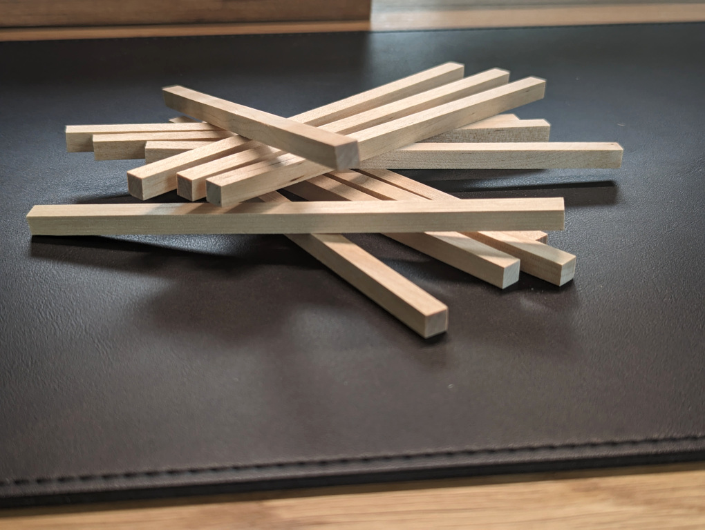
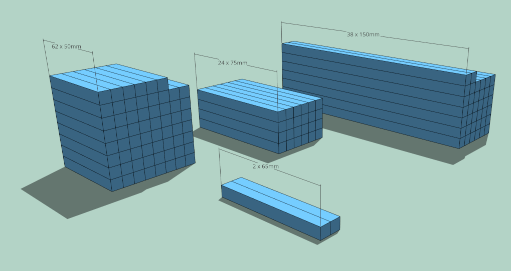
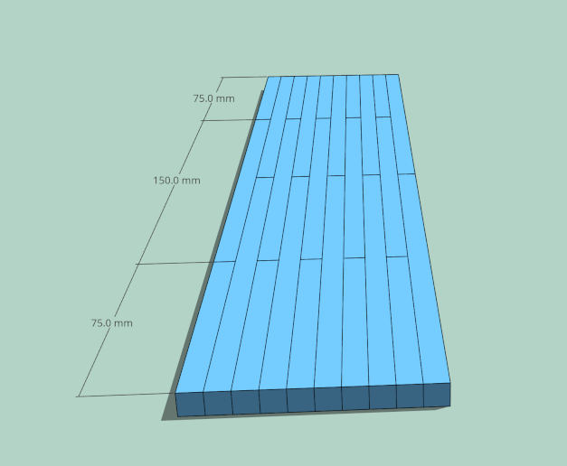
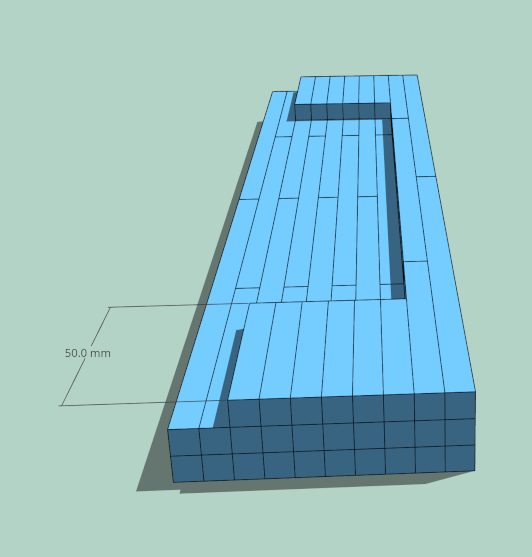
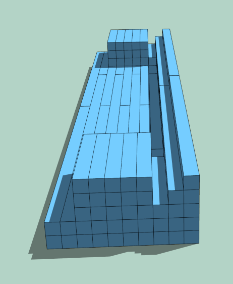
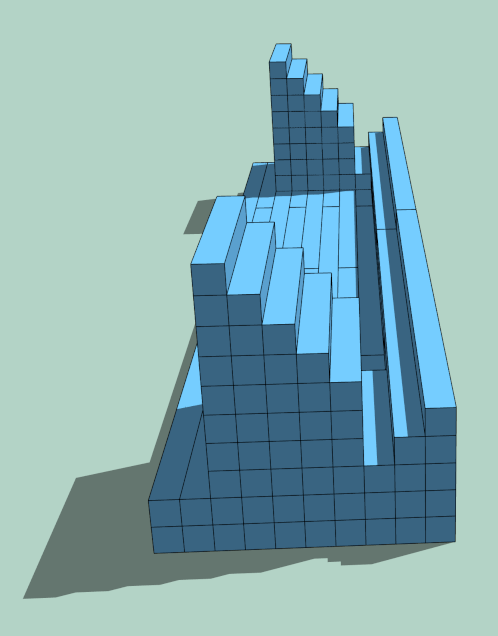
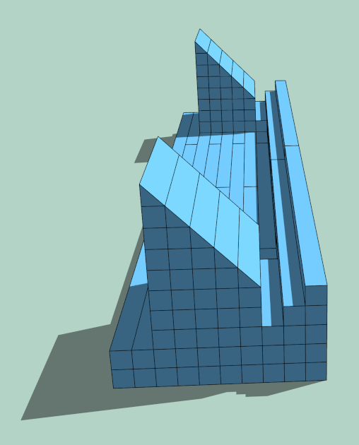
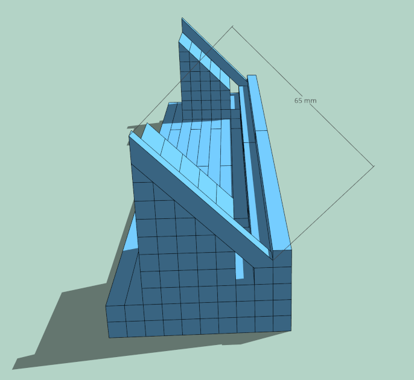
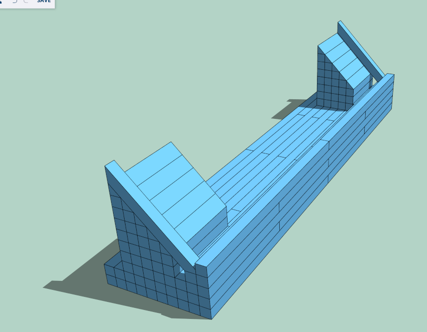

# Install Guide - Wooden Case

The wooden case for Desk HUD is built from square sticks glued together. You will need the following materials and follow these step-by-step instructions:

## Materials:

- 72 Wooden square sticks: 150mm x 6.5mm x 6.5mm
- Wood glue
- Sandpaper
- Oak-colored paint or wood stain

## Instructions:

Begin by preparing the wooden sticks. Keep 38 sticks at the length of 150mm, cut 24 sticks to 75mm, 2 sticks to 65mm, and 62 sticks to 50mm. Ensure all the cuts are clean and accurate.

Start building the first layer of the case. Apply a thin layer of wood glue on the sides of the sticks and press them together firmly. Ensure the sticks are aligned properly. Allow the glue to dry according to the manufacturer's instructions before proceeding to another layer

Repeat the previous step to assemble the subsequent layers of the case, following the provided images as a guide. Take care to align the sticks accurately and maintain the desired shape and dimensions of the case.

Use sandpaper to remove corners of the stairs-like surface and turn it into a smooth edge.

After the glue has dried, use sandpaper to smooth out any rough edges or imperfections on the case. Ensure all surfaces are even and smooth to create a cohesive and solid body.

Once the case is smooth, you can apply an oak-colored paint or wood stain of your choice. Follow the instructions on the paint/stain product for the best results. Apply multiple coats if necessary, allowing proper drying time between each coat.

After the paint or stain has dried completely, your wooden case for Desk-HUD is ready! You can now place the hardware components inside the case and enjoy its design.

