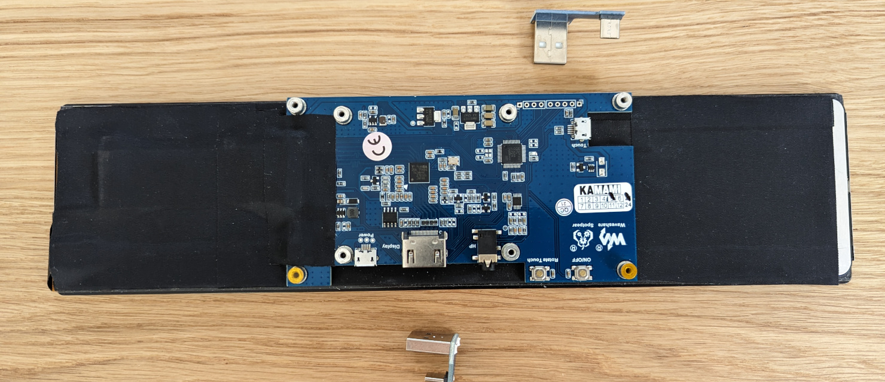
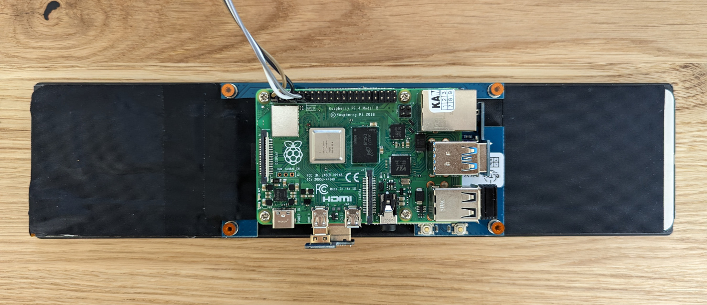
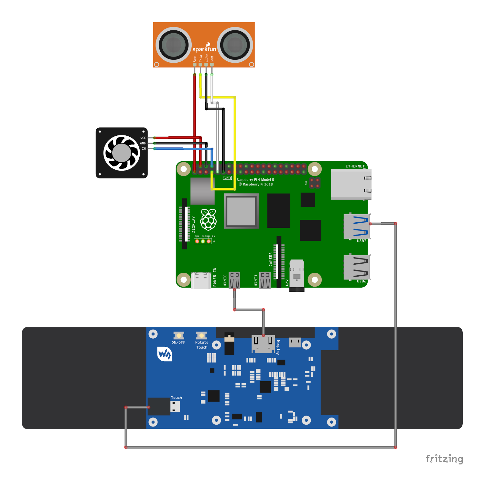

# Install Guide - Hardware

## Shopping List

Necessary hardware:
- [Raspberry PI 4 Model B](https://www.raspberrypi.com/products/raspberry-pi-4-model-b/)
- [Waveshare 11.9inch HDMI touch screen](https://www.waveshare.com/11.9inch-hdmi-lcd.htm)
- [SparkFun Ultrasonic Distance Sensor - HC-SR04](https://www.sparkfun.com/products/17777)
- [Jumper Wires female-female](https://blog.sparkfuneducation.com/what-is-jumper-wire)
- [32GB SD Card with Raspberry Pi OS](https://projects.raspberrypi.org/en/projects/raspberry-pi-setting-up/2)
- [Angle USB-C Cable](https://eu.ugreen.com/collections/cables/products/ugreen-usb-c-to-usb-c-cable-60w-1?variant=40400840556627)
- [20W USB Charger](https://eu.ugreen.com/collections/chargers/products/power-supply-pd-3-0?variant=40296226586707)

## Assembly hardware

Mount [Raspberry PI](https://www.raspberrypi.com/products/raspberry-pi-4-model-b/) to the [touch screen](https://www.waveshare.com/11.9inch-hdmi-lcd.htm) with included screws and distances. Connect HDMI and touch screen USB with included adapters. Install SD Card with Raspberry PI OS.

Wire [distance sensor](https://www.sparkfun.com/products/17777) to GPIO pins of [Raspberry PI](https://www.raspberrypi.com/products/raspberry-pi-4-model-b/). Connect the GND at first, otherwise, it will affect the normal work of the module.   

Power up [Raspberry PI](https://www.raspberrypi.com/products/raspberry-pi-4-model-b/) by connecting to USB charger. Make sure that touch screen is working correctly. It may have wrong orientation. Fix it using "Rotate Touch" button on the back of the screen 